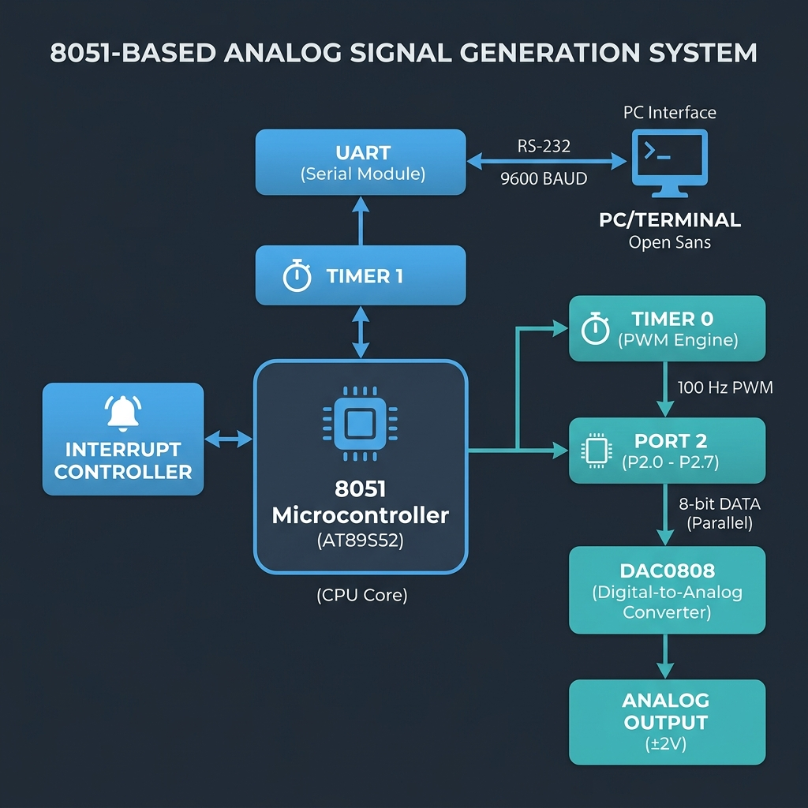

<p align="center">
  
</p>

<h1 align="center">⚡ PWM-Based DAC Controller with Serial Interface</h1>

<p align="center">
  <strong>Real-time variable duty-cycle PWM driving an 8-bit DAC, with live serial control — built entirely in 8051 assembly</strong>
</p>

<p align="center">
  
  
  
  
  
</p>

---

## 📋 Table of Contents

- [Overview](#-overview)
- [Key Features](#-key-features)
- [System Architecture](#-system-architecture)
- [Technical Specifications](#-technical-specifications)
- [Theory of Operation](#-theory-of-operation)
- [Hardware Requirements](#-hardware-requirements)
- [Getting Started](#-getting-started)
- [Repository Structure](#-repository-structure)
- [Results & Analysis](#-results--analysis)
- [References](#-references)
- [License](#-license)

---

## 🔬 Overview

This project implements a **software-defined PWM waveform generator** on the 8051 microcontroller that drives a **DAC0808** to produce a bipolar analog output (±2V). The duty cycle — and therefore the average analog voltage — can be **adjusted in real time** via UART serial commands from a PC or terminal.

The system demonstrates three key embedded systems concepts working in concert:

| Concept | Implementation |
|---|---|
| **Interrupt-driven multitasking** | Timer 0 ISR generates PWM at 100 Hz while the main loop handles serial I/O |
| **Peripheral interfacing** | 8-bit parallel DAC on Port 2, UART on Port 3 |
| **Real-time control** | Serial command → duty cycle update in < 6 µs |

> **Context**: Developed as part of the Microcontroller & Embedded Systems laboratory coursework (Electronics Engineering).

---

## ✨ Key Features

- 🔄 **100 Hz Software PWM** — Timer 0 interrupt-driven with 1% duty cycle resolution (100 steps)
- 📡 **9600 Baud UART** — Live duty cycle adjustment via serial terminal
- 🎛️ **8-bit DAC Output** — Bipolar ±2V analog output through DAC0808
- ⚡ **3% CPU Utilization** — ISR completes in ~12 machine cycles (6 µs), leaving 97% for application logic
- 🔧 **Zero External PWM Hardware** — Entirely software-generated using timer interrupts
- 📐 **Deterministic Timing** — Jitter-free 100 µs interrupt period at 24 MHz

---

## 🏗️ System Architecture

```
┌─────────────────────────────────────────────────────────────────────┐
│                        8051 Microcontroller                        │
│                                                                     │
│  ┌──────────────┐    ┌──────────────┐    ┌───────────────────────┐  │
│  │   Timer 0    │───▶│  Interrupt   │───▶│   PWM ISR             │  │
│  │  Mode 2      │    │  Controller  │    │   ┌───────────────┐   │  │
│  │  100 µs tick │    │  (IE=82h)    │    │   │ R1 < R0? HIGH │   │  │
│  └──────────────┘    └──────────────┘    │   │ R1 ≥ R0? LOW  │   │  │
│                                          │   └───────┬───────┘   │  │
│  ┌──────────────┐    ┌──────────────┐    └───────────┼───────────┘  │
│  │   Timer 1    │───▶│    UART      │                │              │
│  │  Baud Rate   │    │  Mode 1      │         ┌──────▼──────┐      │
│  │  Generator   │    │  9600 Baud   │         │   Port 2    │      │
│  └──────────────┘    └──────┬───────┘         │  (8-bit)    │      │
│                             │                 └──────┬──────┘      │
└─────────────────────────────┼────────────────────────┼──────────────┘
                              │                        │
                     ┌────────▼────────┐      ┌────────▼────────┐
                     │   PC/Terminal   │      │    DAC0808      │
                     │  Serial Input   │      │  ┌──────────┐   │
                     │  (Duty Cycle    │      │  │ 230 → +2V │   │
                     │   0-100)        │      │  │  26 → -2V │   │
                     └─────────────────┘      │  └──────────┘   │
                                              └────────┬────────┘
                                                       │
                                              ┌────────▼────────┐
                                              │  Analog Output  │
                                              │     ±2V         │
                                              └─────────────────┘
```

### Data Flow


---

## 📊 Technical Specifications

| Parameter | Value | Notes |
|---|---|---|
| MCU | AT89S52 / AT89C51 | MCS-51 architecture |
| Clock | 24 MHz | External crystal |
| Machine Cycle | 0.5 µs | 12 clocks/cycle |
| PWM Frequency | 100 Hz | 10 ms period |
| PWM Resolution | 1% (100 steps) | Software counter 0–99 |
| DAC Resolution | 8-bit | 256 levels |
| Output Range | ±2V | Bipolar via op-amp |
| Baud Rate | 9615 baud (~9600) | 0.16% error, SMOD=1 |
| ISR Latency | ~6 µs | 12 machine cycles |
| CPU Overhead | ~3% | 6 µs / 100 µs per interrupt |
| Code Size | < 100 bytes | Fits in minimal ROM |

---

## 📖 Theory of Operation

### PWM Generation via Timer Interrupts

The 8051 lacks dedicated PWM hardware, so we implement it entirely in software:

```
Timer 0 (Mode 2, Auto-Reload)
├── Reload Value: 56 → Overflows every 200 counts = 100 µs
├── ISR increments R1 (tick counter: 0 → 99)
├── Each tick: compare R1 vs R0 (duty threshold)
│   ├── R1 < R0  → Port 2 = 230 (DAC outputs +2V)
│   └── R1 ≥ R0  → Port 2 = 26  (DAC outputs -2V)
└── After 100 ticks → new PWM cycle (10 ms = 100 Hz)
```

### Duty Cycle Mapping

```
Duty Cycle (%) = R0 × 1%

Average Analog Output:
V_avg = -2V + (4V × R0/100)

Examples:
  R0 = 0   →   0% duty → V_avg = -2.0V
  R0 = 25  →  25% duty → V_avg = -1.0V  (default)
  R0 = 50  →  50% duty → V_avg =  0.0V
  R0 = 75  →  75% duty → V_avg = +1.0V
  R0 = 100 → 100% duty → V_avg = +2.0V
```

### Baud Rate Derivation

```
Baud = (2^SMOD / 32) × (F_osc / 12) / (256 - TH1)
     = (2 / 32) × (24,000,000 / 12) / (256 - 243)
     = 0.0625 × 2,000,000 / 13
     = 125,000 / 13
     ≈ 9615 baud  (error: +0.16%)
```

### Interrupt Timing Budget

```
ISR worst-case execution: 12 machine cycles = 6 µs
Available budget per interrupt: 200 cycles = 100 µs
─────────────────────────────────────────────────
CPU utilization = 6 µs / 100 µs = 3%
                  ████░░░░░░░░░░░░░░░░ (97% free for main loop)
```

> 📚 For detailed theoretical analysis, see [docs/theory.md](docs/theory.md)

---

## 🔧 Hardware Requirements

| Component | Specification | Purpose |
|---|---|---|
| 8051 MCU | AT89S52 | Main controller |
| Crystal | 24 MHz + 33pF caps | Clock source |
| DAC | DAC0808 | Digital-to-analog conversion |
| Op-Amp | LM741 / TL071 | Bipolar output stage (±2V) |
| Serial | MAX232 / CP2102 | PC serial communication |
| Power | +5V, ±12V rails | System power |

> 📚 For full wiring guide and circuit description, see [docs/hardware_setup.md](docs/hardware_setup.md)

---

## 🚀 Getting Started

### Prerequisites

- [Keil µVision](https://www.keil.com/download/product/) (or any 8051-compatible assembler)
- [Proteus](https://www.labcenter.com/) (optional, for simulation)
- Hardware: AT89S52 dev board + DAC circuit (for physical implementation)

### Build

```bash
# Clone the repository
git clone https://github.com/SahilSharma1306/8051-pwm-dac-controller.git
cd 8051-pwm-dac-controller

# Assemble using Keil (command-line)
A51 src/pwm_dac_serial.asm

# Or open in Keil µVision IDE:
# 1. Create new project → Select AT89S52
# 2. Add src/pwm_dac_serial.asm to Source Group
# 3. Build → generates .hex file
```

### Flash to Hardware

```bash
# Using a compatible programmer (e.g., USBasp)
avrdude -c usbasp -p 8052 -U flash:w:pwm_dac_serial.hex
```

### Serial Control

```bash
# Using any serial terminal (PuTTY, Tera Term, minicom)
# Settings: 9600 baud, 8-N-1, No flow control

# Send a byte (0-100) to set duty cycle:
#   0   → 0% duty   → -2V output
#   50  → 50% duty  → 0V output
#   100 → 100% duty → +2V output
```

---

## 📁 Repository Structure

```
8051-pwm-dac-controller/
│
├── 📄 README.md                          # This file
├── 📄 LICENSE                            # MIT License
├── 📄 .gitignore                         # Build artifacts & IDE files
│
├── 📂 src/
│   └── 📄 pwm_dac_serial.asm            # Main source (documented assembly)
│
├── 📂 docs/
│   ├── 📄 theory.md                      # Detailed theoretical background
│   ├── 📄 hardware_setup.md              # Circuit & wiring guide
│   └── 📂 assignment/
│       └── 📄 Microcontroller_Assignment_Group-A.pdf
│
└── 📂 assets/
    └── 🖼️ system_block_diagram.png       # Architecture diagram
```

---

## 📈 Results & Analysis

### PWM Output Characteristics

| Duty Cycle (R0) | Expected Frequency | Expected V_avg | Behavior |
|---|---|---|---|
| 0 | 100 Hz | −2.0V | Constant LOW (−2V on DAC) |
| 25 (default) | 100 Hz | −1.0V | 25% HIGH, 75% LOW |
| 50 | 100 Hz | 0.0V | Square wave (50/50) |
| 75 | 100 Hz | +1.0V | 75% HIGH, 25% LOW |
| 100 | 100 Hz | +2.0V | Constant HIGH (+2V on DAC) |

### Performance Metrics

| Metric | Value |
|---|---|
| Code Size | ~90 bytes (ROM) |
| RAM Usage | 2 registers (R0, R1) |
| Interrupt Jitter | < 1 machine cycle (0.5 µs) |
| Serial Response Time | < 1 PWM cycle (10 ms) |
| Maximum ISR Duration | 6 µs (12 cycles) |

### Key Design Decisions

1. **Software PWM over hardware** — Demonstrates low-level timer and interrupt mastery; the 8051 has no built-in PWM peripheral
2. **Polling for serial, interrupts for PWM** — PWM timing is critical (must be jitter-free), while serial reception is latency-tolerant. This prioritization avoids interrupt contention
3. **Direct register update** — The received byte writes directly to `R0` (duty cycle threshold), achieving sub-microsecond update latency with zero buffering overhead
4. **8-bit auto-reload timers** — Mode 2 eliminates the need to manually reload timer values in the ISR, reducing ISR complexity and cycle count

---

## 📚 References

1. Mazidi, M. A., Mazidi, J. G., & McKinlay, R. D. — *The 8051 Microcontroller and Embedded Systems Using Assembly and C* (2nd Ed., Pearson)
2. Atmel Corporation — [AT89S52 Datasheet](https://ww1.microchip.com/downloads/en/DeviceDoc/doc1919.pdf) (Rev. 1919D)
3. National Semiconductor — *DAC0808 8-Bit D/A Converter Datasheet*
4. Intel Corporation — *MCS-51 Microcontroller Family User's Manual* (1994)
5. Horowitz, P. & Hill, W. — *The Art of Electronics* (3rd Ed., Cambridge University Press)

---

## 📜 License

This project is licensed under the **MIT License** — see [LICENSE](LICENSE) for details.

---

<p align="center">
  <sub>Built with ⚡ bare-metal assembly — no frameworks, no abstractions, just registers and opcodes.</sub>
</p>
